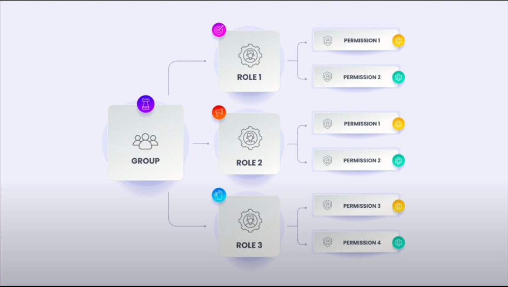
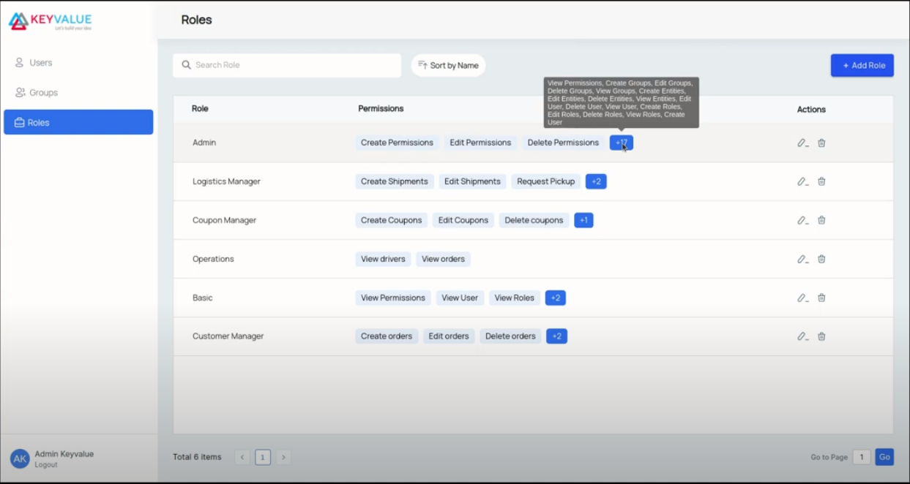
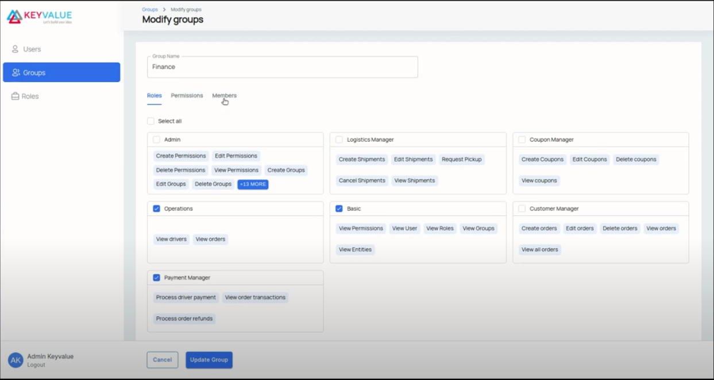
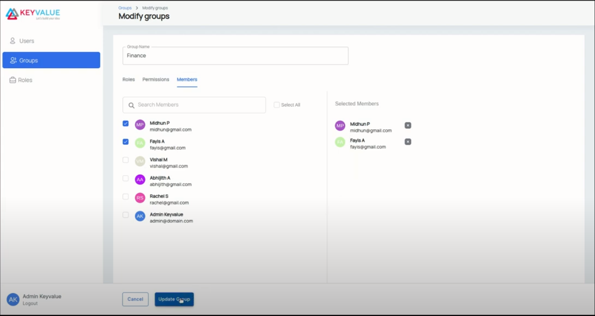
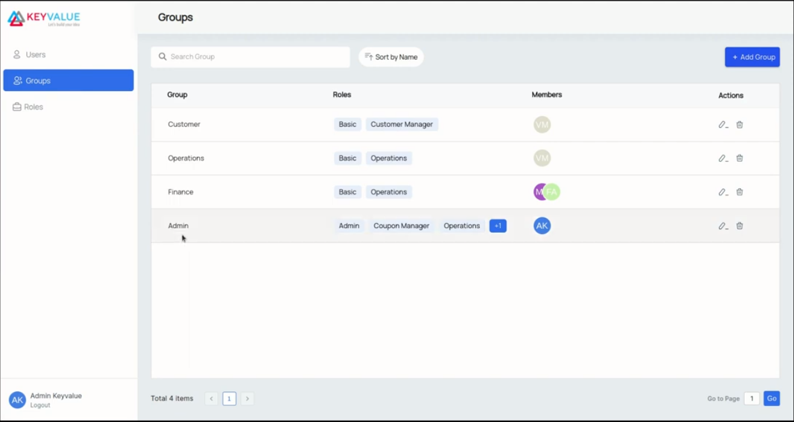
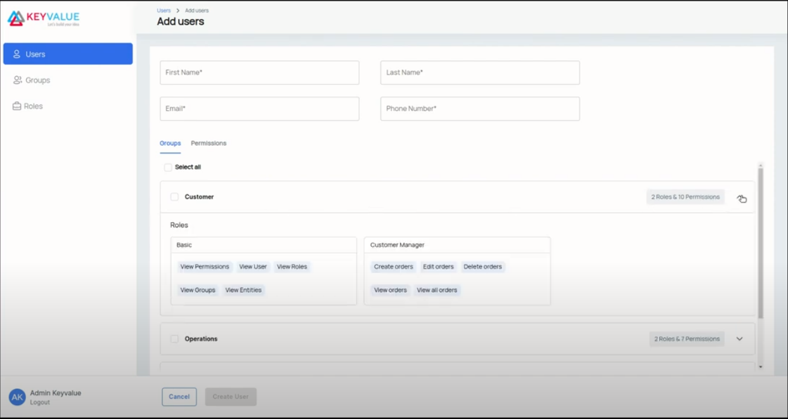
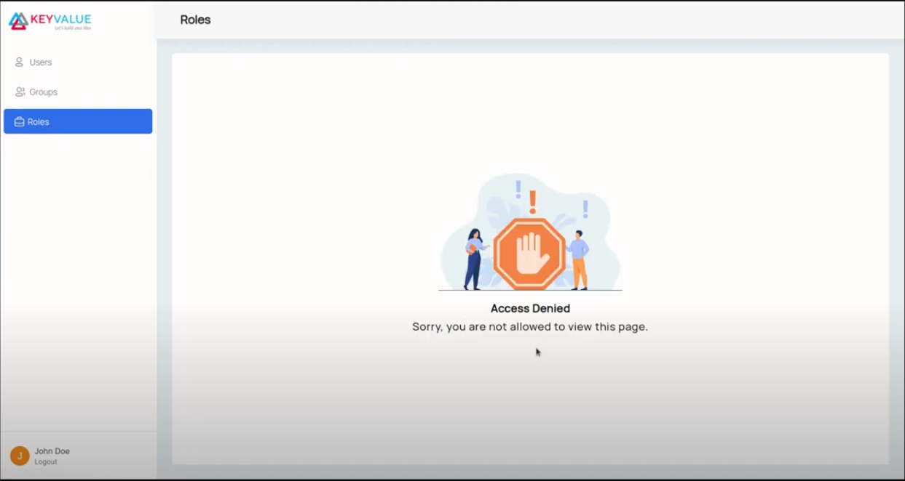

## User Management System - Features

Upon installation, <b>UMS</b> (User Management System) creates a Super-Admin, who is responsible for creating other admins, employees and groups. Super-Admins are responsible for defining role based access. With <b>UMS</b>, Super-Admin can effortlessly manage the user base of organisation and ensure that the users have the correct access to perform their job effectively.

  

     
  

> The User can login to <b>UMS</b> using credentials, username (email) and password

Once logged in, user will be presented with three tabs. 1. Users 2. Groups 3. Roles

<b>UMS</b> primarily works around three layers.

  

     
  

> Permissions comes in the lowest layer simply denote the actions the user can perform
> Roles can be assigned to any number of permissions. They are a collection of permissions.
> Groups can be assigned to any number of roles. They are a collection of roles.
> Groups get its permissions extracted from all the roles assigned to it

  

     
  

> Users have groups assigned to them

A role can be created by making use of "<b>Add Role</b>" button in the roles listing page. In the add role page, the user can give the role a name and select the permissions from the list given as collections based on modules

  

     
  

Upon clicking "<b>Create Role</b>" button, the role is created and available in the roles tab.

The created role can be added to an existing group using the edit functionality.

Similar to role creation, groups can be created using "<b>Add Group</b>" button in the groups tab. In the group edit/create page, the group name and the roles assigned to the group can be changed. Apart from that, the user can associate permissions to a group using the permissions tab and also add users to the group using the members tab in this page.

  

     
  

> In Permissions tab, the default permissions from the roles selected will be pre-selected.

  

     
  

In the Members tab, all the available users will be listed and the selected users will be listed under "<b>Selected Members</b>"

A new user can be created using "<b>Add user</b>" button in the Users tab. In the add user page, we can give _First Name, Last Name, Email and Phone Number_. All these fields are mandatory.

Groups and Permissions can be assigned to the created user using the "<b>Groups</b>" and "<b>Permissions</b>" tab present.

  

     
  

> The group, role or user can be deleted using the "Delete" icon available on each tab.

The created user will be on "Invited" status and will have an invite link to set up his password. Upon accessing the invite link, the new user is navigated to a password setup page. After setting up the password, the user is redirected to the login page.

  

     
  

If the admin removes any view permission for any user, the user will not be able to view the corresponding page from then. If the user tries to access any page to which he doesn't have access, an Access Denied message will be shown.

  

     
  

Details of any user can be viewed by clicking on the corresponding user entry in the User tab. The user's profile details along with the groups and permissions available to that user will be displayed there

Search and Sort feature is provided to all the three tabs (Users, Groups and Roles). Users can also be filtered based on their status or groups assigned to them by using the "<b>Add Filter</b>" button on Users tab.
